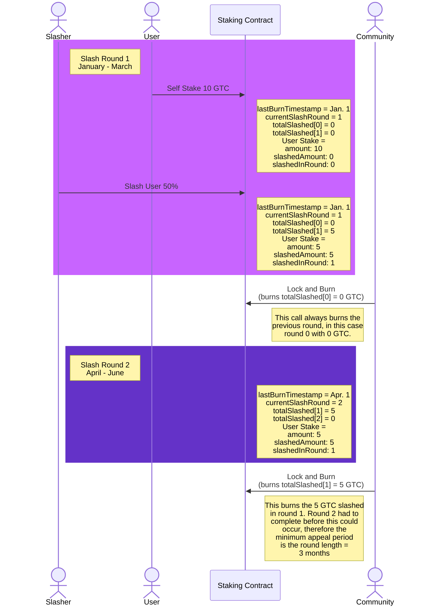
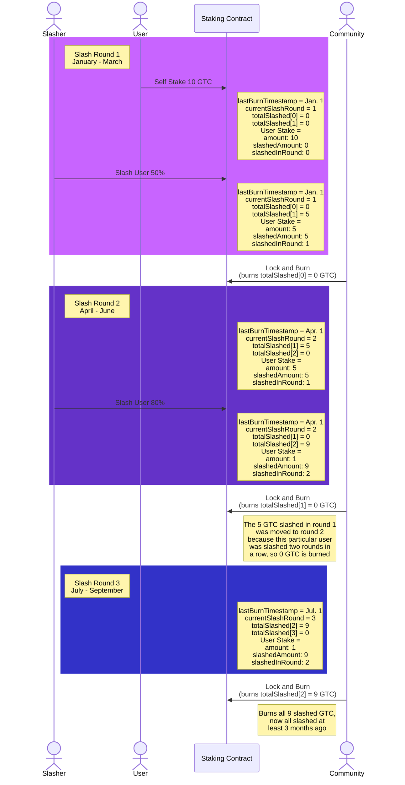
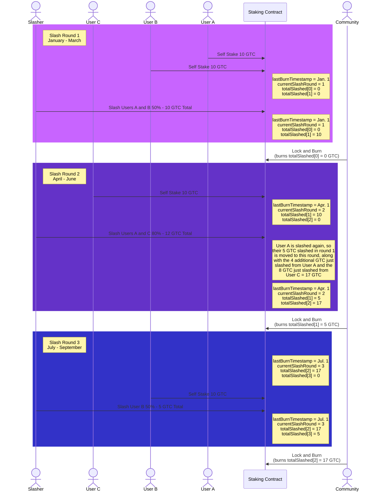

# Identity Staking V2

This repo contains the Identity Staking V2 contract. These were the goals when
writing this contract:

- Allow users to stake on themselves and others for a given duration
- Make staking and re-staking as gas-efficient as possible
- Be able to determine the total GTC staked by a user (self + community)
- Allow slashing of users who commit slash-able offenses
- Allow slashing to be appealed, with a minimum appeal period of 90 days
- Allow successfully appealed GTC to be released
- GTC staked in this contract should only possibly be able to be...
    1. Held by the contract (staked or frozen)
    2. Burned
    3. Returned to the original owner
- Slashing, burning, and releasing must be gas-efficient enough to be practical
- Events should be emitted to allow simple indexing of all activity

## Table of Contents

1. [Working with the repo](#working-with-the-repo)
2. [IdentityStaking.sol](#identitystakingsol)
    1. [Methods](#methods)
    2. [Events](#events)
    3. [State](#state)
    4. [Appendix A: Slashing Rounds](#appendix-a-slashing-rounds)
    5. [Appendix B: Slashing in Consecutive Rounds](#appendix-b-slashing-in-consecutive-rounds)
    6. [Appendix C: Diagrams](#appendix-c-diagrams)
    7. [Appendix D: Security](#appendix-d-security)
3. [IIdentityStaking.sol](#iidentitystakingsol)

## Working with the repo

```shell
REPORT_GAS=true npx hardhat test
npx hardhat run scripts/deploy.ts --network <network>
```

## IdentityStaking.sol

### Methods

#### selfStake

```solidity
function selfStake(uint88 amount, uint64 duration) external whenNotPaused;
```

Add `amount` GTC to your stake on yourself. Minimum `duration` is 12 weeks,
maximum `duration` is 104 weeks (2 years).

If you have an existing self-stake, then the `duration` must end later than the
existing self-stake's `unlockTime`.

The `unlockTime` of **all** of your self-stake will be extended to the end of
the new `duration`.

#### extendSelfStake

```solidity
function extendSelfStake(uint64 duration) external whenNotPaused;
```

Set existing self-stake's unlock time to the end of `duration`. Minimum
`duration` is 12 weeks, maximum `duration` is 104 weeks (2 years).

The `duration` must end later than the existing self-stake's `unlockTime`.

#### withdrawSelfStake

```solidity
function withdrawSelfStake(uint88 amount) external whenNotPaused;
```

Withdraw `amount` GTC from your unlocked self-stake.

#### communityStake

```solidity
function communityStake(address stakee, uint88 amount, uint64 duration) external whenNotPaused;
```

Add `amount` GTC to your stake on `stakee`. Minimum `duration` is 12 weeks,
maximum `duration` is 104 weeks (2 years).

If you have an existing community-stake on `stakee`, then the `duration` must end
later than the existing community-stake's `unlockTime`.

The `unlockTime` of **all** of your community-stake on `stakee` will be
extended to the end of the new `duration`.

#### extendCommunityStake

```solidity
function extendCommunityStake(address stakee, uint64 duration) external whenNotPaused;
```

Set existing community-stake's unlock time to the end of `duration`. Minimum
`duration` is 12 weeks, maximum `duration` is 104 weeks (2 years).

The `duration` must end later than the existing community-stake's `unlockTime`.

#### withdrawCommunityStake

```solidity
function withdrawCommunityStake(address stakee, uint88 amount) external whenNotPaused;
```

Withdraw `amount` GTC from your unlocked community-stake on `stakee`.

#### slash

```solidity
function slash(address[] selfStakers, address[] communityStakers, address[] communityStakees, uint64 percent) external onlyRole(SLASHER_ROLE) whenNotPaused;
```

Slash the provided addresses by `percent`. Addresses in `selfStakers` correspond
to self-stakes to be slashed. The address in `communityStakers` and
`communityStakees` correspond to community stakes to be slashed, such that
`communityStakers[i]` has a community-stake on `communityStakees[i]`.

This function can only be called by an address with the `SLASHER_ROLE`.

`percent` must be between 1 and 100.

*Note: All staked GTC is liable to be slashed, even if it is past
its unlockTime*

#### lockAndBurn

```solidity
function lockAndBurn() external whenNotPaused;
```

This function is to be called every three months (`burnRoundMinimumDuration`).

When called this will lock the current round, burn the previous round, and
start a new round.

Anyone can call this function. The `roundMinimumDuration` facilitates the
logic to keep everything in sync.

See [Appendix A: Slashing Rounds](./#appendix-a-slashing-rounds) for more details.

#### release

```solidity
function release(address staker, address stakee, uint88 amountToRelease, uint16 slashRound) external onlyRole(RELEASER_ROLE) whenNotPaused;
```

Release `amountToRelease` GTC from the community stake on `stakee` by `staker`.
If `staker` is the same as `stakee`, then this is a self-stake. If `slashRound`
is two or more rounds previous to the current round, then the stake is
already burned and this function will fail.

This function can only be called by an address with the `RELEASER_ROLE`.

#### pause

```solidity
function pause() external onlyRole(PAUSER_ROLE) whenNotPaused;
```

Pause the contract. This function can only be called by an address with the
`PAUSER_ROLE`.

#### unpause

```solidity
function unpause() external onlyRole(PAUSER_ROLE) whenPaused;
```

Unpause the contract. This function can only be called by an address with the
`PAUSER_ROLE`.

### Events

#### SelfStake

```solidity
event SelfStake(address indexed staker, uint88 amount, uint64 unlockTime);
```

Emitted when a self-stake is added/increased/extended. `amount` is the additional
amount added for this particular transaction (could be `0` for an extension).
`unlockTime` applies to the full self-stake amount for this `staker`.

#### CommunityStake

```solidity
event CommunityStake(address indexed staker, address indexed stakee, uint88 amount, uint64 unlockTime);
```

Emitted when a community-stake is added/increased/extended. `amount` is the
additional amount added for this particular transaction (could be `0` for an
extension). `unlockTime` applies to the full community-stake amount for this
`staker` on this `stakee`.

#### SelfStakeWithdrawn

```solidity
event SelfStakeWithdrawn(address indexed staker, uint88 amount);
```

Emitted when a self-stake is withdrawn. `amount` is the amount withdrawn in this
transaction.

#### CommunityStakeWithdrawn

```solidity
event CommunityStakeWithdrawn(address indexed staker, address indexed stakee, uint88 amount);
```

Emitted when a community-stake is withdrawn. `amount` is the amount withdrawn in
this transaction.

#### Slash

```solidity
event Slash(address indexed staker, uint88 amount, uint16 round);
```

Emitted when a slash occurs. `amount` is the total amount slashed in this
transaction. `round` is the round in which the slash occurred.

#### LockAndBurn

```solidity
event LockAndBurn(uint16 indexed round, uint88 amount);
```

Emitted when a lockAndBurn occurs. `round` is the round that was burned, and
`amount` is the total amount burned in this transaction.

### State

#### SLASHER_ROLE

```solidity
bytes32 public constant SLASHER_ROLE = keccak256("SLASHER_ROLE");
```

Role held by addresses which are permitted to submit a slash.

#### RELEASER_ROLE

```solidity
bytes32 public constant RELEASER_ROLE = keccak256("RELEASER_ROLE");
```

Role held by addresses which are permitted to release an un-burned slash.

#### PAUSER_ROLE

```solidity
bytes32 public constant PAUSER_ROLE = keccak256("PAUSER_ROLE");
```

Role held by addresses which are permitted to pause the contract.

#### struct Stake

```solidity
struct Stake {
  uint64 unlockTime;
  uint88 amount;
  uint88 slashedAmount;
  uint16 slashedInRound;
}
```

- `unlockTime` is the unix time in seconds after which this stake can be
  withdrawn.
- `amount` is the amount of GTC staked.
      - Note: `uint88` can hold ~300 million with 18 decimals, which is 3x the
      current GTC supply.
      - Note: this *does not* include any GTC that has been slashed
      - Note: this *does* include slashed GTC that has been released
- `slashedAmount` is the amount of GTC slashed (could be burned already)
- `slashedInRound` is the round in which this stake was last slashed

#### selfStakes

```solidity
mapping(address => Stake) public selfStakes;
```

Self-stakes by a user. The `address` is the staker. The `Stake` struct is
described above.

#### communityStakes

```solidity
mapping(address => mapping(address => Stake)) public communityStakes;
```

Community-stakes by a user on a stakee. The first `address` is the staker, the
second `address` is the stakee. The `Stake` struct is described above.

#### userTotalStaked

```solidity
mapping(address => uint88) public userTotalStaked;
```

Total amount of GTC staked by a user. This includes self-stakes and community
stakes on all stakees. This does not include any GTC that has been slashed.

#### currentSlashRound

```solidity
uint16 public currentSlashRound = 1;
```

The current slash round. This is incremented on each call to `lockAndBurn`.
See [Appendix A: Slashing Rounds](./#appendix-a-slashing-rounds).

#### burnRoundMinimumDuration

```solidity
uint64 public burnRoundMinimumDuration = 90 days;
```

The minimum duration between slash rounds. See
[Appendix A: Slashing Rounds](./#appendix-a-slashing-rounds).

This value cannot be modified.

#### lastBurnTimestamp

```solidity
uint256 public lastBurnTimestamp;
```

The timestamp of the last call to `lockAndBurn`. See
[Appendix A: Slashing Rounds](./#appendix-a-slashing-rounds).

Initially set to the contract's deployment time.

#### burnAddress

```solidity
address public burnAddress
```

The address to which burned stake is sent. Only configurable on initialization.

The GTC contract does not allow for transfers to the zero address, so the
address of the GTC contract itself will be used as the `burnAddress` instead.
Tokens transferred to the GTC contract cannot ever be retrieved by anyone.

#### totalSlashed

```solidity
mapping(uint256 => uint88) public totalSlashed;
```

The current slash total for each slash round, to track the amounts to be
burned.

#### gtc

```solidity
GTC public gtc;
```

The GTC token contract.

### Appendix A: Slashing Rounds

Rounds exist for the sole purpose of facilitating the timing around slashing,
waiting a given duration to allow time for appeals (90 days), and then burning
the remaining slashed amount.

This is much more gas-efficient than tracking individual slashes and their
appeal periods.

*Note for comprehending the next section: This is talking about **slash** age,
not **stake** age. Slash age is the time since the slash occurred.*

On each call to `lockAndBurn`...

- the current round contains all the slashes younger than the last `lockAndBurn`
  (effectively 0-90 days old), these are to be locked
- the previous round contains all the non-released slashes older than this (at
  least older than the `burnRoundMinimumDuration`, effectively 90-180 days old),
  and so it is burned
- the current round becomes the previous round, and a new round is initiated

The contract is initiated with `currentSlashRound = 1`. On the very first call
to `lockAndBurn`, nothing will be burned.

`lockAndBurn` may not necessarily be called right away after the
`burnRoundMinimumDuration`, but this is okay. This just means that
some slashes will technically have a bit longer to appeal. All we
care about is enforcing a **minimum** appeal period.

There is a caveat to this if a user is slashed in consecutive rounds. See
[Appendix B](./#appendix-b-slashing-in-consecutive-rounds) for more details.

### Appendix B: Slashing in Consecutive Rounds

If a user is slashed, and they had also been slashed in the previous round, then
that user's slashAmount from the previous round will be rolled into the current
round. Otherwise, the slashAmount from the previous would not be able to be
released.

In a non-abuse situation where a user has consecutive slashes that are not
appealed, this simply means that the stake will remain frozen longer
(potentially indefinitely), before being burned. This should be a non-issue
in practice.

In an abuse situation (a user keeps committing slash-able offenses in order to
delay their frozen stake from being burned):

- The attacker must keep dumping in stake to be slashed, so they're just
  digging a bigger hole and ultimately burning more GTC.
- If the user is not slashed for a round, then this cycle is broken. So the
  slashers can refuse to slash a user for a round to break the cycle.
- Some sort of appeal limit (included in the T&C) can be implemented to prevent
  abuse in the form of wasting the appeal council's time.

### Appendix C: Diagrams

Normal slashing and burning, demonstrating the minimum appeal period:



Slashing in Consecutive Rounds:



Several Users:



### Appendix D: Security

#### Reentrancy

This contract is not susceptible to reentrancy attacks. All state changes are
made before any external calls are made. Additionally, external calls are made
only to the GTC contract set at initialization, which is a trusted contract.

#### Token Ownership

The tokens in this contract can only be in three states:

1. Held by the contract (staked or frozen)
2. Burned
3. Returned to the original owner

The contract *cannot* send tokens to any address other than the original owner,
or the burn address.

#### Token Amounts

Token amounts are stored as `uint88` which can hold
309,485,009,821,345,068,724,781,055 or just over 300 million with 18 decimals.
This is 3x the current GTC supply.

If this contract is used with tokens other than GTC, or if enough GTC were
minted to exceed this amount, then the contract would need to be updated.
Currently uint88s are used so that all stake info fits in a single 256 byte
slot, which provides huge gas savings.

If the current contract needs to be upgraded after the GTC supply exceeds this
max supply, the following could be done:

*Note: These scenarios are not fully thought out and may need some tweaks to be
completely viable. These are just high level proof-of-concepts.*

Option 1: Do nothing. In the extremely unlikely event that one of the uint88s
were to exceed the max uint88, then the contract would revert. In the perfect
storm, a user could not be slashed in a particular round. But this is
exceedingly unlikely and not a huge deal anyways. Users could still withdraw
their existing stake.

Option 2: Add an explicit stake amount cap, user total stake cap, and a round
cap at MAX_UINT88. This should effectively change nothing, it's the same as
option 1 but with a clearer intention.

Option 3: If we want to really consider what would be necessary to handle much
larger amounts (i.e. in a hyperinflation scenario), then the following could be
done:

1. If necessary the contract can be paused while this upgrade is pending.
2. The contract could be upgraded to start considering all uint88 `amount`
   parameters to have e.g. 16 decimals. There could be a
   `mapping (address => bool) amountUses16Decimals` to track which amounts are
   using 16 decimals. (Note: This is high level, in reality we need to track
   self, community, slash round amounts, etc.)
3. 18 decimal amounts would be divided by 100 to get the new amount, when those
   amounts are interacted with. Any change leftover could be refunded to The user.
4. After all 18 decimal stake is withdrawn/burned, the logic to handle
   both 16 and 18 decimal amounts at the same time could be removed. If
   some old stakes are holding on, there could be a one-time refund to the user
   of any leftover change (would need to be a new function, with guarantees
   to only be called once, etc.).

#### OpenZeppelin Contracts

Where it makes sense, we've used OpenZeppelin's contracts to handle generic
functionality (access control, pausing, and upgrading). These contracts are
well-vetted and audited.

#### `block.timestamp` usage

`block.timestamp` is sometimes a source of security issues because nodes can
tweak it a bit. However, in this contract, `block.timestamp` is only used to
determine when stake is staked and when it can be withdrawn. This happens over
long periods of a minimum of 12 weeks.

The danger with `block.timestamp` is when it's used to derive randomness, or
when changing the value by a few seconds or less could have a significant
impact. This is not the case in this contract.

An alternative would be to rely on the average block time and calculate block
numbers, but then this would need to be configurable in case the average block
time changes in the future. So this would be a source of manipulation and
potential error. Further, it's simply unnecessary as explained above.

## IIdentityStaking.sol

This contract defines a minimal interface for the data that is likely to be
useful onchain, for easy integration with other contracts.

There are accessors for [selfStakes](#selfstakes),
[communityStakes](#communitystakes), and [userTotalStaked](#usertotalstaked).
